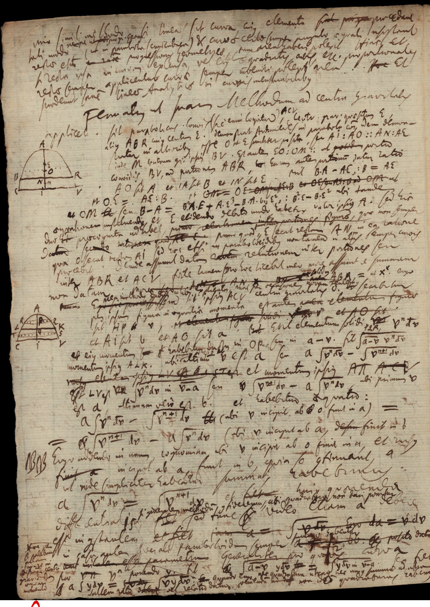
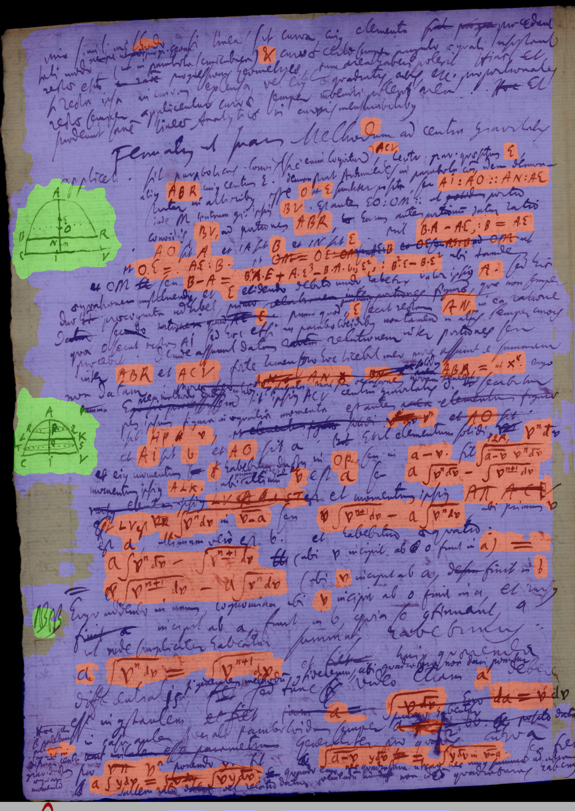
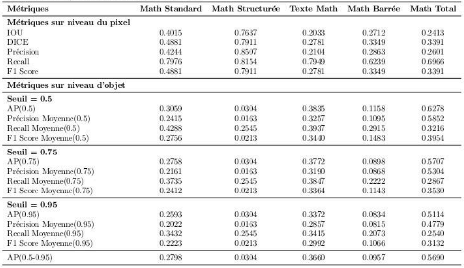

# Segmentation d'images de documents anciens par réseaux profonds
Détecter les Expressions Mathématiques dans les images manuscrites de Leibniz

## Introduction
Les manuscrits de Leibniz offrent un aperçu essentiel de sa pensée, mais leur transcription manuelle est fastidieuse. Pour automatiser ce processus, nous utilisons un réseau neuronal entièrement convolutif pour détecter et segmenter les expressions mathématiques au niveau des pixels.  

Notre approche repose sur le modèle pré-entraîné Doc-UFCN, initialement conçu pour détecter les lignes de texte dans les manuscrits. Nous l'avons ré-entrainé sur un ensemble de données enrichi d’images artificielles et appliqué diverses techniques d’augmentation. Une fonction de perte d'entropie croisée pondérée, adaptée au contenu, a été proposée pour optimiser l’apprentissage.  

Une fois les images traitées par le modèle, des masques segmentent les expressions mathématiques. Enfin, nous évaluons la performance à l’aide de métriques au niveau des pixels et des objets.

  

## Images d'annotation et segmentée

  
  

## Image artificielle

# Structure de dossier
## Dossier "OriginalImage":
- 33 images originales.
## Dossier "AnnotedImage":
- 58 images coupées en deux et dont la zone d'informations sur l'image blanche a été supprimée.
- 58 fichiers sous format de json exportés dans l'interface XAnylabeling.
- Résultats de l'analyse du rapport de pixels pour différentes catégories de chaque sous-ensemble de données. Résultats de l'analyse du rapport de pixels pour différentes catégories dans chaque image. Nombre d'annotations de différentes catégories dans chaque image.

## Dossier "Preprocess":
### pixelMetricsAnnotation.py: Creation les masques, Division des sous ensemble de données, l'analyse des données, Visualisation des binarisation des donnees.
- readImageMask(image_folder):générer des masques d'annotation précis à partir d'images et de leurs fichiers d'annotation associés. Les masques sortis sont dans le dossier "Preprocess/Labelmap"
- countannotation(image_folder): compter le nombre d'annotation des images
- analyze(image_folder,labelmap_folder): analyser la proportion des differentes categories dans toutes les images
- split_dataset(image_folder,labelmap_folder,data_folder,background_folder): repartir les images aux trois sous ensemble de donnees et creer les images d'arrieres-plan et analyser chaque ensemble de donnees.
- binarisation_show(images): Presenter differents resultats des images sous deux methodes de binarisation. 
### tool.py: Decoupage image en deux images, Suppression de zone blanche d'image, Visualisation l'element d'annotation, Visualisation des figures pendant validation, Creation des images d'arrieres-plan.
- watch_annotations('../AnnotedImage'): Visualisation element d'expression mathematique dont sa taille est minimum.
- combine_loss_figure: Visualisation des resultats exportes pendant validation. 
- get_background('../AnnotedImage', './Background'): Creation les images d'arrieres-plan pour creation des images synthetiques.
- remove_Bottom_image_folder: Suppression des zones blanches dans le bas d'image
- split_image_vertically_folder: Decoupage l'image aux deux selon sa moitie de largeur.
### Changename: Nomination des images apres decoupage

# Utilisation

## Configuration.ini
1. Configuration des parametres dans le fichier "configuration.ini"
	### [General] : Paramètres généraux de l'expérience	
	- num_workers : Définit le nombre de threads utilisés pour charger les données.
	- experiment_name : Nom de l'expérience (exp par exemple).
	- steps : Décrit l'étape actuelle du processus（'train,prediction,evaluation')
	- classes_names : Liste des classes à segmenter : texte, figure, math, et background (arrière-plan).
	- 	class_X_color : Couleurs associées à chaque classe. Les couleurs sont en format RGB :
	- 	class_0_color = 0,0,255 : Le texte sera représenté en bleu.
	- 	class_1_color = 0,255,0 : Les figures en vert.
	- 	class_2_color = 255,0,0 : Les mathématiques en rouge.
	- 	class_3_color = 128,128,128 : L'arrière-plan en gris.
	- 	start_ratio et end_ratio : Définissent les ratios des images reelles au debut et a la fin du cycle d'entrainement pour la strategie d'echantillonnage dynamique pendant l'entraînement. (0-1)
	- 	img_size : Taille des images decoupage pour l'entrainement et la prediction.
	- 	no_of_epochs : Nombre d'époques d'entraînement
	- 	batch_size : Taille du lot d'entraînement à utiliser.
	- 	desired_batchsize : Taille de lot simule pour la strategie d'accumulation de gradient.
	- 	bin size : Taille des sous-intervalles pour la strategie de regroupement du seau
	- 	learning_rate : Taux d'apprentissage initial du modèle .
	- 	min_cc : Taille minimale des composants connectés, utilisée pour filtrer de petites régions dans les résultats de prediction.
	- 	save_image : Dossier où seront enregistrées les images générées après traitement (test).
	- 	use_amp : Utilisation ou non de la précision mixte pour accélérer les calculs avec moins de mémoire.
	- 	loss : Type de fonction de perte à utiliser pour l’entraînement (si le modèle d'entraînement est interrompu et doit continuer l'entraînement au point d'interruption, utilisez "best", si le modèle pré-entraîné est utilisé pour affiner (fine-tuning) différentes tâches, utilisez " initial").
	- 	same_classes : Indique si les classes doivent être considérées comme égales (utilisez "True" si la formation du modèle est interrompue et que la formation doit être poursuivie là où elle s'est arrêtée. Si le modèle pré-entraîné est utilisé pour affiner différentes tâches, le les classes requises pour les tâches sont les mêmes, utilisez "True". Si le modèle pré-entraîné est affiné sur différentes tâches et que les catégories requises pour les tâches sont différentes,utilisez "False").
	- 	generated_images : Indique si on genere les images synthetiques pendant l'entrainement.
	### [Paths] : Chemins des dossiers de résultats
	- model_path : Chemin vers le fichier de modèle pré-entraîné à utiliser pour l'entrainement et la prédiction (.pth).
	- 	prediction_path : Chemin où les prédictions du modèle seront sauvegardées (prediction).
	- 	evaluation_path : Dossier pour les résultats d'évaluation (evaluation).
	- 	tb_path : Dossier pour stocker les logs de TensorBoard (events).
	- 	log_path : Chemin pour stocker les fichiers journaux (logs).
	- 	bgrdir : Chemin vers le dossier des images d'arrière-plan (background).
	### [DataPaths] : Chemins vers les données d'entraînement, de validation et de test
	- train_image : Chemin vers les images d'entraînement.
	- 	train_mask : Chemin vers les masques de segmentation des images d'entraînement.
	- 	train_json : Chemin vers les fichiers JSON contenant les annotations des images d'entraînement.
	- 	val_image : Chemin vers les images de validation.
	- 	val_mask : Chemin vers les masques de validation.
	- 	val_json : Chemin vers les fichiers JSON des images de validation.
	- 	test_image : Chemin vers les images de test.
	- 	test_json : Chemin vers les fichiers JSON des annotations de test.

# Exemple:
### [General] : Paramètres généraux de l'expérience	
	- num_workers : 0(Facultatif).
	- experiment_name : exp (Facultatif).
	- steps : train
	- classes_names : texte, figure, math, et background (arrière-plan).
	- 	class_0_color = 0,0,255 : Le texte sera représenté en bleu.(Correspondant a la couleur de texte dans le masque)
	- 	class_1_color = 0,255,0 : Les figures en vert.(Correspondant a la couleur de figure dans le masque)
	- 	class_2_color = 255,0,0 : Les mathématiques en rouge.(Correspondant a la couleur de math dans le masque)
	- 	class_3_color = 128,128,128 : L'arrière-plan en gris.(Correspondant a la couleur de l'arriere-plan dans le masque)
	- 	start_ratio et end_ratio : 0.5,0.5(Facultatif)
	- 	img_size : 768(Facultatif)
	- 	no_of_epochs : 350(Facultatif)
	- 	batch_size : 2(Facultatif)
	- 	desired_batchsize : 8(Facultatif)
	- 	bin size : 20(Facultatif)
	- 	learning_rate : 1e-2(Facultatif)
	- 	min_cc : 2400(Facultatif)
	- 	save_image : test
	- 	use_amp : false(Facultatif)
	- 	loss : initial(fine-tuning)/ best(resume).
	- 	same_classes : false
	- 	generated_images : true
	### [Paths] : Chemins des dossiers de résultats
	- model_path : /generic-historical-line/modele_meilleur.pth(Facultatif)
	- 	prediction_path : prediction(Facultatif)
	- 	evaluation_path : evaluation(Facultatif)
	- 	tb_path :events(Facultatif)
	- 	log_path : ./logs(Facultatif)
	- 	bgrdir : ./background(Facultatif)
	### [DataPaths] : Chemins vers les données d'entraînement, de validation et de test
	- train_image :  ./Data/training/train/images
	- 	train_mask : /Data/training/train/labels
	- 	train_json : ./Data/training/train/labels_json
	- 	val_image :  ./Data/training/val/images
	- 	val_mask : ./Data/training/val/labels
	- 	val_json : ./Data/training/val/labels_json
	- 	test_image :  ./Data/training/test/images
	- 	test_json : ./Data/training/test/labels_json

#### python ./main.py

## Dossier "logs/exp(nom d'experience)/":
- exp.json: Enregistrer les paramètres utilisés dans le fichier configuration.ini
- generic-historical-line: Stocker le modele meilleur et modele dernier pendant l'entrainement.
- Images_in_valid: Enregistrer les images exportees dans le premier lot dans l'etape validation.
- events: Enregistrer le journal d'experience au fichier pour visualiser dans tensorboard.
- norm_parms: Valeurs pour normalisation dans l'entrainement

## Dossier "logs/exp(nom d'experience)/prediction/test/training/":
- Images segmentées et ses masques sorties apres la prédiction.
- Objets segmentes 
- Images coupees segmentées et ses masques sorties apres la prédiction.

## Dossier "logs/exp(nom d'experience)/evaluation/test/":
- training_results.jon: Enregistrer les resultats des metriques sur niveau du pixel et niveau d'objet de differentes categories dans l'ensemble de test.
- confusion_matrix__object_combinedgray: Matrice de confusion au niveau d'objet calculée à partir de pixels gris contenant « Texte, Figure, Math »
- confusion_matrix__object_gray:Matrice de confusion au niveau d'objet calculée à partir de pixels gris contenant « Texte, Figure, MathStandard,MathStructuree, TexteMath,Mathbarree »
- confusion_matrix_pixel_combined:Matrice de confusion au niveau du pixel contenant « Texte, Figure, Math »
- math_pixel_metrics: Metriques sur niveau du pixel de cette categorie.
- Precision_math_total,Recall_math_total,F-score_math_total,Precision-recall_math_total(gray):Metriques sur niveau d'objet de cette categorie.

## Resultats des indicateurs aux deux niveaux pour le modele meilleur

  

## Rapport de stage
Si vous voulez savoir plus de details, Vous pouvez consulter le [rapport de stage ici](https://drive.google.com/file/d/1Yyos3R1O3P42BNH5Mgtp7LMdvXcAaFkp/view?usp=sharing).

## Resultats
Vous pouvez voir [les resultats de test ici](https://drive.google.com/drive/folders/1ioDa4tyGEb3EsdZM9PzOxEgL4mLQGNFr?usp=sharing).

## Modele
Vous pouvez obtenir[le modele fine-tuned et modele original ici](https://drive.google.com/drive/folders/1-bWrAtEtV2AXMNg3sQ9HscfmWkDVBU7I?usp=sharing).

